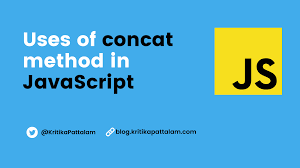
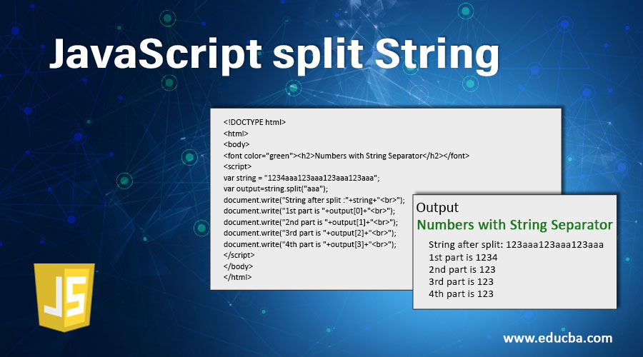
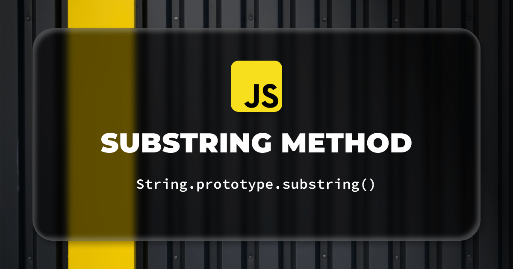
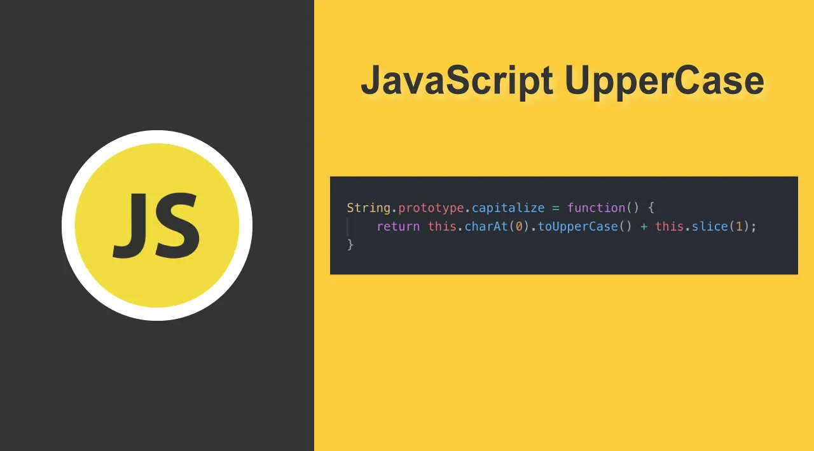
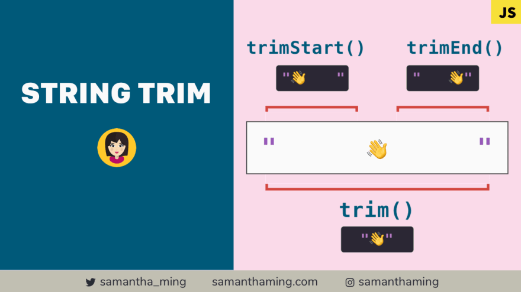
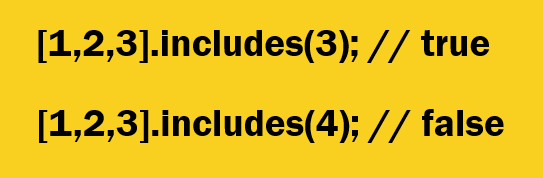
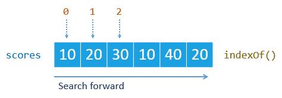

# String
# Ин текст мебошад.

# Method

## A method is a block of code which only runs when it is called.
## You can pass data, known as parameters, into a method.
# Дар  Js 3 намуди string мебошад.
## "" , '', ``.
# Дар JS 15 намуди методи string маълум аст.
## 1. Char AT:

### И методи кухнахай. Як параметр мегира. Барои индекса ёфтан.Факат + мегира.
## 2. AT:

### И методи навай. Хам + мегира хам - мегира.
## 3. Concet:

### Барои 2 ва зиёда стринга якчоя кадан.
## 4. Replace:

### Метона ай даруни стринг дилхох символа бгира ба дилхох символ иваз кна.
## 5. ReplaceALL:
### Ранги replace мебошад.Чандтаи бёва хамаша иваз мекна.
## 6. Split:

### Стринги мора ба массиф табдил медихад.
## 7. Substring:

### Ай кисм ба кисми стрига гирифтан.
## 8. Slice:

### ранги Sunstring мебошад.Бо метона - бгира.
## 9. toUpperCase:

### Барои харфои майдара калон кадан.
## 10. toLowerCase:

### Барои харфои калона майда кадан.
## 11. Trim:

### Барои удалить кадани пробел.
## 12. Includes:

### и як методай ки як параметр мегира.Рузултаташ бошад true and false мебошад.
## 13. ToString:
### Любой чиза мегира String мекна.
## 14. IndexOff:

### Барои индекси String ёфтан. Агар мо ягон харфи дигарш бтен результать -1 мешава.
## 15. Repeat:
### Метона дилхох символа такрор кна.

